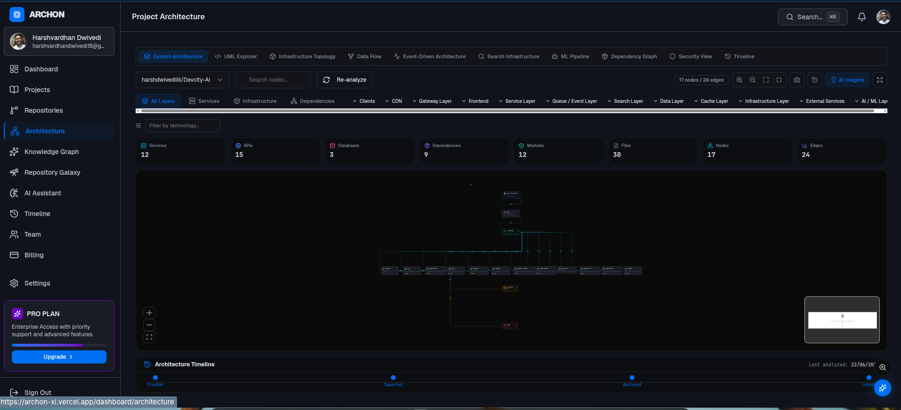

<p align="center">
  
</p>

<div align="center">

# 🏛️ Archon

**AI-Powered Engineering Intelligence Platform**

[](https://nextjs.org)
[](https://www.typescriptlang.org)
[](https://www.prisma.io)
[](https://www.postgresql.org)
[](https://openai.com)
[](https://reactflow.dev)
[](https://stitch.mcp)
[](https://vercel.com)
[](LICENSE)

<br />

**Transform any repository into a living architecture intelligence system.**

Archon ingests codebases via GitHub OAuth, runs a multi-stage AI-powered analysis engine, and generates interactive architecture diagrams, knowledge graphs, infrastructure blueprints, dependency maps, and comprehensive documentation — turning complex codebases into understandable, navigable systems.

</div>

<br />

---

## 🎥 Product Demo

<p align="center">
  
</p>

<p align="center">
  <em>Live repository analysis, architecture generation, and AI-powered insights.</em>
</p>

---

## ✨ Features

<div align="center">

| 🧠 Intelligence | 🏗️ Architecture | 🔬 Analysis |
|:---|---:|:---|
| **AI Architecture Analysis** — Pattern classification, tech stack enrichment, design recommendations | **System Architecture Diagrams** — Interactive layered diagrams with React Flow | **Repository Intelligence** — Deep codebase scanning with AST parsing |
| **AI Copilot** — Conversational assistant for architecture questions | **UML Generation** — Class, interface, and relationship diagrams | **Technology Detection** — 40+ frameworks, languages, and tools |
| **Knowledge Graph** — Entity-relationship graph from code analysis | **Data Flow Visualization** — Request, event, and message flow maps | **Dependency Mapping** — Internal, external, circular, and dead deps |
| **Security Scanning** — Automated secret detection and risk classification | **DevOps Intelligence** — Docker, K8s, Terraform, CI/CD discovery | **Impact Analysis** — Blast radius and risk scoring for every service |
| **Documentation Engine** — Auto-generated README, API, and architecture docs | **Architecture Timeline** — Version-controlled snapshot comparison | **API Detection** — REST, GraphQL, WebSocket, gRPC endpoint discovery |

</div>

---

## 🔄 How It Works

```
  Connect Repository (GitHub OAuth)
          │
          ▼
    Repository Analysis
  ┌─────────────────────────────────────┐
  │ • Shallow clone (simple-git)        │
  │ • File walker traverses codebase    │
  │ • AST parsing (TS, JS, Python,      │
  │   Go, Rust, Java)                   │
  └─────────────────────────────────────┘
          │
          ▼
    Technology Detection
  ┌─────────────────────────────────────┐
  │ • Frontend: Next.js, React, Vue,    │
  │   Angular, Svelte, Vite             │
  │ • Backend: Express, NestJS, Django, │
  │   Flask, FastAPI, Rails, Laravel    │
  │ • Database: Postgres, MySQL,        │
  │   MongoDB, Redis, SQLite, ES        │
  │ • Infra: Docker, K8s, Terraform,    │
  │   AWS, Azure, GCP, CI/CD            │
  └─────────────────────────────────────┘
          │
          ▼
    Architecture Generation
  ┌─────────────────────────────────────┐
  │ • Service detection & classification│
  │ • Dependency graph construction     │
  │ • Layer-based layout (7 layers)     │
  │ • React Flow diagram generation     │
  └─────────────────────────────────────┘
          │
          ▼
    Knowledge Graph Creation
  ┌─────────────────────────────────────┐
  │ • Entity extraction (services,      │
  │   APIs, databases, modules)         │
  │ • Relationship mapping (imports,    │
  │   calls, dependencies, deployments) │
  │ • Persistent graph storage          │
  └─────────────────────────────────────┘
          │
          ▼
    AI Insights (OpenAI GPT-4o)
  ┌─────────────────────────────────────┐
  │ • Architecture pattern classification│
  │ • Technology stack enrichment        │
  │ • Design recommendations            │
  │ • Service description enrichment    │
  │ • Complexity & scalability rating   │
  └─────────────────────────────────────┘
          │
          ▼
    Documentation Generation
  ┌─────────────────────────────────────┐
  │ • Architecture overview             │
  │ • Service documentation             │
  │ • API reference                     │
  │ • Database documentation            │
  │ • Infrastructure overview           │
  └─────────────────────────────────────┘
```

---

## 🏗️ Architecture Workspace

<p align="center">
  
</p>

<p align="center">
  <em>Enterprise-grade architecture canvas with infinite zoom, pan, minimap, and 10 visualization modes.</em>
</p>

---

## 🚀 Quick Start

### Prerequisites

- **Node.js** 18+
- **PostgreSQL** 14+
- **GitHub OAuth App** — For authentication
- **Google OAuth App** — For authentication
- **OpenAI API Key** — For AI features

### Installation

```bash
# Clone the repository
git clone https://github.com/your-org/archon.git
cd archon

# Install dependencies
npm install

# Set up environment variables
cp .env.example .env
# Edit .env with your credentials

# Initialize the database
npm run db:generate
npm run db:migrate

# Start the development server
npm run dev
```

The application will be available at [http://localhost:3000](http://localhost:3000).

---

## 🔐 Environment Variables

> All variables are **required** unless marked as optional. Never commit `.env` to version control.

| Variable | Required | Description |
|----------|:--------:|-------------|
| `DATABASE_URL` | ✅ | PostgreSQL connection URL (supports pgBouncer) |
| `DIRECT_DATABASE_URL` | ❌ | Direct URL for Prisma migrations (non-pooled) |
| `AUTH_SECRET` | ✅ | Auth.js secret (min 32 chars). Generate with `openssl rand -base64 32` |
| `AUTH_URL` | ❌ | Canonical URL for Auth.js callbacks |
| `AUTH_GITHUB_ID` | ✅ | GitHub OAuth Client ID |
| `AUTH_GITHUB_SECRET` | ✅ | GitHub OAuth Client Secret |
| `AUTH_GOOGLE_ID` | ✅ | Google OAuth Client ID |
| `AUTH_GOOGLE_SECRET` | ✅ | Google OAuth Client Secret |
| `OPENAI_API_KEY` | ✅ | OpenAI API key |
| `OPENAI_MODEL` | ❌ | Model identifier (default: `gpt-4o`) |
| `STRIPE_SECRET_KEY` | ❌ | Stripe secret key for billing |
| `STRIPE_WEBHOOK_SECRET` | ❌ | Stripe webhook signing secret |
| `NEXT_PUBLIC_STRIPE_PUBLISHABLE_KEY` | ❌ | Stripe publishable key |
| `RESEND_API_KEY` | ❌ | Resend API key for email invitations |
| `R2_ACCOUNT_ID` | ❌ | Cloudflare R2 account ID |
| `R2_ACCESS_KEY_ID` | ❌ | Cloudflare R2 access key |
| `R2_SECRET_ACCESS_KEY` | ❌ | Cloudflare R2 secret key |
| `R2_BUCKET` | ❌ | Cloudflare R2 bucket name |
| `NEXT_PUBLIC_POSTHOG_KEY` | ❌ | PostHog project API key |
| `NEXT_PUBLIC_POSTHOG_HOST` | ❌ | PostHog host URL |
| `SENTRY_DSN` | ❌ | Sentry DSN for error tracking |
| `NEXT_PUBLIC_APP_URL` | ✅ | Public URL (e.g., `https://archon.dev`) |

---

## 📸 Screenshots

<div align="center">
  <table>
    <tr>
      <td align="center"><strong>Dashboard Overview</strong></td>
      <td align="center"><strong>Architecture Diagram</strong></td>
    </tr>
    <tr>
      <td></td>
      <td></td>
    </tr>
    <tr>
      <td align="center"><strong>Knowledge Graph</strong></td>
      <td align="center"><strong>AI Assistant</strong></td>
    </tr>
    <tr>
      <td></td>
      <td></td>
    </tr>
  </table>
</div>

---

## 🛠️ Tech Stack

### Frontend
| Technology | Purpose |
|------------|---------|
| **Next.js 16** (App Router) | Full-stack framework, server components, API routes |
| **React 19** | UI library |
| **Tailwind CSS** | Utility-first styling |
| **shadcn/ui** (Radix Primitives) | Accessible UI components |
| **@xyflow/react** (React Flow) | Interactive architecture diagrams |
| **Framer Motion** | Page animations and transitions |
| **Recharts** | Charts and statistics |
| **Lucide React** | Icon library |

### Backend & Database
| Technology | Purpose |
|------------|---------|
| **Next.js API Routes** | REST API endpoints |
| **TypeScript** (strict mode) | End-to-end type safety |
| **Auth.js v5** (NextAuth) | Authentication with Prisma adapter |
| **PostgreSQL 16** | Primary database |
| **Prisma 7** | ORM with pgBouncer support |
| **Zod** | Runtime validation |

### AI & Analysis
| Technology | Purpose |
|------------|---------|
| **OpenAI GPT-4o / GPT-4o-mini** | Architecture analysis, chat, graph generation |
| **simple-git** | Repository cloning (shallow, depth=1) |
| **TypeScript Compiler API** | AST parsing for `.ts`/`.tsx` |
| **@babel/parser** | AST parsing for `.js`/`.jsx` |

### Infrastructure
| Technology | Purpose |
|------------|---------|
| **Docker** | Local development with `docker-compose` |
| **Vercel** | Primary deployment target |
| **Cloudflare R2** | File storage for analysis artifacts |
| **Stripe** | Subscription billing (Free/Pro/Team/Enterprise) |
| **Resend** | Email delivery for team invitations |
| **Sentry** | Error tracking and monitoring |
| **PostHog** | Product analytics |

---

## 📁 Project Structure

```
archon/
├── app/                           # Next.js App Router
│   ├── dashboard/                 # Protected dashboard pages
│   │   ├── architecture/          # Interactive React Flow diagrams (10 modes)
│   │   ├── knowledge-graph/       # Entity-relationship graph visualization
│   │   ├── ai-assistant/          # Streaming AI chat interface
│   │   ├── timeline/              # Architecture change timeline
│   │   ├── repositories/          # GitHub import + analysis
│   │   ├── projects/              # Project CRUD
│   │   ├── team/                  # Team management + invitations
│   │   ├── billing/               # Stripe subscription management
│   │   ├── settings/              # User profile settings
│   │   ├── impact/                # Blast radius impact analysis
│   │   ├── profile/               # User profile (GitHub/Google data)
│   │   └── client.tsx             # Dashboard overview with real stats
│   ├── api/                       # REST API routes
│   └── page.tsx                   # Landing page
├── components/
│   ├── layout/                    # Dashboard sidebar + header
│   ├── landing/                   # Landing page sections
│   ├── ui/                        # shadcn/ui components
│   └── providers/                 # Session provider
├── lib/
│   ├── auth/                      # Auth.js configuration
│   ├── analysis/                  # Core analysis engine
│   │   ├── detectors/             # 7 technology detectors
│   │   ├── ast-parser.ts          # Multi-language AST parser
│   │   ├── graph-builder.ts       # Knowledge graph construction
│   │   ├── diagram-generator.ts   # React Flow layout generator
│   │   ├── doc-generator.ts       # Markdown documentation
│   │   ├── security.ts            # Secret scanning engine
│   │   └── clone.ts               # Git clone with timeout
│   ├── ai/                        # OpenAI integration
│   │   ├── chat.ts                # Streaming chat
│   │   ├── architecture-analyzer.ts # Pattern classification
│   │   └── graph-generation.ts    # Knowledge graph from content
│   ├── db/                        # Prisma client singleton
│   └── env.ts                     # Zod-validated environment
├── prisma/
│   ├── schema.prisma              # 18 database models
│   └── migrations/
└── docker-compose.yml
```

---

## 🌐 API Overview

All API routes require authentication via Auth.js session cookies unless noted.

| Category | Endpoints | Purpose |
|----------|-----------|---------|
| **Auth** | `GET /api/auth/me` | Current user profile |
| **Workspace** | `GET/POST /api/workspace` | Multi-tenant workspace management |
| **Projects** | `GET/POST /api/projects` | Project CRUD with repository counts |
| **Repositories** | `GET /api/repositories`, `POST /api/github/sync` | Import and analyze repos |
| **Analysis** | `GET /api/analysis/progress/:id`, `/api/analysis/results/:id` | SSE progress + results |
| **AI** | `POST /api/ai/chat` | Streaming AI architecture chat |
| **Graph** | `GET /api/graph` | Knowledge graph nodes and edges |
| **Diagrams** | `GET /api/diagrams` | Architecture diagram listing |
| **Timeline** | `GET /api/timeline` | Chronological activity feed |
| **Impact** | `GET /api/impact` | Blast radius and risk analysis |
| **Search** | `GET /api/search` | Global search across all entities |
| **Settings** | `GET/PUT /api/settings` | User profile settings |
| **Team** | `POST /api/invitations` | Email-based team invitations |
| **Billing** | `GET /api/billing` | Subscription and plan info |
| **Health** | `GET /api/health` | Multi-service diagnostics (unauthenticated) |

---

## 🤝 Contributing

We welcome contributions from the community.

```bash
# Fork and clone
git clone https://github.com/your-username/archon.git
cd archon

# Install dependencies
npm install

# Copy environment template
cp .env.example .env

# Set up the database
npm run db:generate
npm run db:migrate

# Start development
npm run dev
```

### Code Quality

```bash
npm run lint       # ESLint
npm run typecheck  # TypeScript strict checks
npm run build      # Production build
```

### Guidelines

- Follow existing code style (TypeScript strict mode, functional components)
- Use Prisma for database changes (`npm run db:migrate`)
- Add Zod validation for new environment variables
- Use shadcn/ui components for UI elements
- Keep the dashboard dark mode by default

---

## 📄 License

MIT License — see [LICENSE](LICENSE) for details.

---

<br />

<p align="center">
  Built with ❤️ for Software Architects, CTOs, Platform Engineers, DevOps Teams, and Developers.
</p>

<p align="center">
  <a href="https://nextjs.org">Next.js</a> ·
  <a href="https://www.typescriptlang.org">TypeScript</a> ·
  <a href="https://www.prisma.io">Prisma</a> ·
  <a href="https://www.postgresql.org">PostgreSQL</a> ·
  <a href="https://openai.com">OpenAI</a> ·
  <a href="https://reactflow.dev">React Flow</a> ·
  <a href="https://vercel.com">Vercel</a>
</p>
