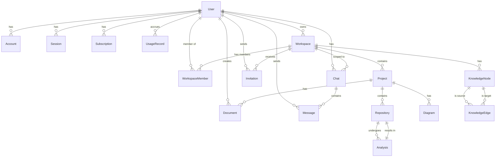

# Archon

**AI-Powered Engineering Intelligence Platform**

Archon transforms repositories into living architecture diagrams, knowledge graphs, dependency maps, infrastructure blueprints, and AI-powered engineering insights.

[](https://nextjs.org)
[](https://www.typescriptlang.org)
[](https://www.postgresql.org)
[](https://www.prisma.io)
[](https://openai.com)
[](https://docs.github.com/en/apps/oauth-apps)
[](LICENSE)

---

## Overview

Archon is an open-source platform that makes any codebase understandable at a glance. It ingests repositories via GitHub OAuth, runs a multi-stage analysis engine to detect services, APIs, databases, dependencies, and infrastructure, then generates interactive architecture diagrams, knowledge graphs, documentation, and AI-powered explanations.

### Problems It Solves

- **Large codebase understanding** — Instantly grasp what a monolith or microservices system does
- **Missing documentation** — Auto-generate architecture docs, API references, and dependency lists
- **Architecture visibility** — Live, updated diagrams that reflect the actual code
- **Dependency tracking** — See which services depend on what, down to the module level
- **Engineering onboarding** — New team members get a complete system map in minutes
- **Infrastructure discovery** — Detect Docker, Kubernetes, Terraform, and cloud configurations
- **Impact analysis** — Use the AI assistant to ask "what happens if I change service X?"

---

## Key Features

| Feature | Description |
|---------|-------------|
| **Repository Analysis** | Clone and analyze any GitHub repository (public or private) via OAuth |
| **Technology Detection** | Auto-detect 40+ frameworks, languages, databases, and message queues |
| **Architecture Generation** | Build interactive, layered architecture diagrams with ReactFlow |
| **Knowledge Graphs** | Generate and visualize entity-relationship knowledge graphs for any codebase |
| **AI Assistant** | Conversational AI (OpenAI GPT-4o) that answers architecture questions |
| **Dependency Mapping** | Extract dependencies from package.json, requirements.txt, Gemfile, Cargo.toml, go.mod, and more |
| **Infrastructure Discovery** | Detect Docker, Kubernetes, Terraform, CI/CD pipelines, and cloud providers |
| **API Detection** | Identify REST, GraphQL, WebSocket, and gRPC endpoints with authentication flags |
| **Impact Analysis** | Ask the AI what downstream effects a change would have on services |
| **Timeline Tracking** | View all architecture changes (projects, repos, diagrams, docs) in a chronological feed |
| **Documentation Generation** | Auto-generate Markdown documentation from analysis results |
| **Team Collaboration** | Workspace-based multi-user support with role-based access (Owner, Admin, Member, Viewer) |
| **Billing & Plans** | Stripe integration with Free, Pro, Team, and Enterprise tiers |

---

## Tech Stack

### Frontend
| Technology | Usage |
|------------|-------|
| **Next.js 15** (App Router) | Full-stack framework, server components, API routes |
| **React 19** | UI library |
| **Tailwind CSS** | Utility-first styling |
| **shadcn/ui** (Radix Primitives) | Accessible UI components (dialog, dropdown, tabs, accordion, tooltip, select, etc.) |
| **@xyflow/react** | Interactive architecture diagrams (ReactFlow) |
| **Framer Motion** | Animations (landing page, transitions) |
| **Recharts** | Charts and statistics (dashboard, billing) |
| **Lucide React** | Icon library |

### Backend
| Technology | Usage |
|------------|-------|
| **Next.js API Routes** | REST API endpoints |
| **TypeScript** | Type safety throughout |
| **Auth.js (NextAuth v5)** | Authentication with Prisma adapter |
| **Zod** | Runtime environment variable validation |

### Database
| Technology | Usage |
|------------|-------|
| **PostgreSQL** | Primary database |
| **Prisma 7** | ORM with PrismaPg adapter (supports pgBouncer) |

### AI & Analysis
| Technology | Usage |
|------------|-------|
| **OpenAI API** (GPT-4o / GPT-4o-mini) | Architecture analysis, chat, knowledge graph generation |
| **simple-git** | Repository cloning (shallow, depth=1) |
| **TypeScript Compiler API** | AST parsing for TS/TSX |
| **@babel/parser** | AST parsing for JS/JSX |

### Infrastructure
| Technology | Usage |
|------------|-------|
| **Docker** | `docker-compose.yml` for local development |
| **Vercel** | Primary deployment target |
| **Cloudflare R2** | File storage for analysis artifacts |
| **Stripe** | Subscription billing |
| **Resend** | Email invitations |

### Monitoring
| Technology | Usage |
|------------|-------|
| **Sentry** | Error tracking |
| **PostHog** | Product analytics |
| **Health API** | Built-in `/api/health` with multi-service diagnostics |

---

## Folder Structure

```
archon/
├── app/                          # Next.js App Router
│   ├── page.tsx                  # Landing page
│   ├── layout.tsx                # Root layout (dark mode, fonts)
│   ├── login/                    # Authentication page
│   ├── onboarding/               # First-time setup wizard
│   ├── dashboard/                # Protected dashboard pages
│   │   ├── client.tsx            # Dashboard overview (stats, recent repos)
│   │   ├── layout.tsx            # Auth guard for dashboard
│   │   ├── projects/             # Project CRUD
│   │   ├── repositories/         # GitHub import + analysis
│   │   ├── architecture/         # Interactive ReactFlow diagram
│   │   ├── knowledge-graph/      # Knowledge graph visualization
│   │   ├── ai-assistant/         # AI chat interface
│   │   ├── timeline/             # Architecture change timeline
│   │   ├── team/                 # Team member management + invitations
│   │   ├── billing/              # Stripe subscription management
│   │   └── settings/             # User profile settings
│   └── api/                      # API routes
│       ├── auth/me/              # Current user endpoint
│       ├── health/               # Multi-service diagnostics
│       ├── workspace/            # Workspace CRUD
│       ├── projects/             # Project CRUD
│       ├── repositories/         # Repository listing
│       ├── github/repositories/  # GitHub API proxy (list user repos)
│       ├── github/sync/          # Trigger repository analysis
│       ├── analysis/progress/    # SSE progress stream
│       ├── analysis/results/     # Analysis result retrieval
│       ├── ai/chat/              # Streaming AI chat
│       ├── graph/                # Knowledge graph data
│       ├── diagrams/             # Diagram listing
│       ├── invitations/          # Team invitations
│       ├── settings/             # User settings
│       ├── billing/              # Subscription info
│       ├── timeline/             # Timeline events
│       └── debug/auth/           # Auth configuration debug
├── components/
│   ├── layout/                   # Dashboard layout (sidebar, navigation)
│   ├── providers/                # Session provider wrapper
│   ├── architecture/             # Architecture page types
│   └── ui/                       # shadcn/ui components (button, card, dialog, etc.)
├── lib/
│   ├── auth/                     # Auth.js configuration (auth.config.ts, auth.ts)
│   ├── db/prisma.ts              # Prisma client singleton (with pgBouncer support)
│   ├── env.ts                    # Zod-validated environment variables
│   ├── analysis/                 # Core analysis engine
│   │   ├── index.ts              # runAnalysis orchestrator
│   │   ├── clone.ts              # Git clone (shallow, timeout-protected)
│   │   ├── file-walker.ts        # Recursive file traversal
│   │   ├── ast-parser.ts         # AST analysis (TS, JS, Python, Go, Rust, Java)
│   │   ├── graph-builder.ts      # Service dependency graph construction
│   │   ├── diagram-generator.ts  # ReactFlow layout generator (layered, auto-positioned)
│   │   ├── doc-generator.ts      # Markdown documentation generator
│   │   ├── progress.ts           # SSE progress publisher/subscriber
│   │   ├── tech-icons.tsx        # Technology icon mapping
│   │   ├── types.ts              # Analysis type definitions
│   │   └── detectors/            # Technology-specific detectors
│   │       ├── index.ts          # detectAll orchestrator
│   │       ├── frontend.ts       # React, Vue, Angular, Svelte, Next.js, Vite
│   │       ├── backend.ts        # Express, NestJS, Fastify, Spring Boot, Django, Flask, FastAPI, Rails, Laravel
│   │       ├── database.ts       # PostgreSQL, MySQL, MongoDB, Redis, SQLite, Elasticsearch
│   │       ├── dependencies.ts   # package.json, requirements.txt, Gemfile, Cargo.toml, go.mod, gradle, pom.xml
│   │       ├── infra.ts          # Docker, Kubernetes, Terraform, CI/CD, AWS, Azure, GCP
│   │       └── api.ts            # REST, GraphQL, WebSocket, gRPC endpoint detection
│   ├── ai/                       # AI integration layer
│   │   ├── openai.ts             # OpenAI client singleton + connection test
│   │   ├── architecture-analyzer.ts # Deep architecture analysis (patterns, recommendations)
│   │   ├── graph-generation.ts   # Knowledge graph from content
│   │   ├── chat.ts               # Streaming chat helper
│   │   └── repository-analysis.ts # Initial AI repo analysis
│   ├── health/diagnostics.ts     # Multi-service health checks (DB, OpenAI, Stripe, storage)
│   ├── storage/                  # Storage abstraction (local + R2)
│   ├── stripe/client.ts          # Stripe integration
│   └── utils/cn.ts               # Tailwind class merge utility
├── prisma/
│   ├── schema.prisma             # Database schema (14 models)
│   └── migrations/               # Prisma migrations
├── public/                       # Static assets
├── docker-compose.yml            # Local development with PostgreSQL
├── .env.example                  # Environment variable template
├── tailwind.config.ts
├── tsconfig.json
└── package.json
```

---

## Installation

### Prerequisites
- Node.js 18+
- PostgreSQL 14+
- GitHub OAuth App (for authentication)
- Google OAuth App (for authentication)
- OpenAI API key

### Quick Start

```bash
# Clone the repository
git clone https://github.com/your-org/archon.git
cd archon

# Install dependencies
npm install

# Set up environment variables
cp .env.example .env
# Edit .env with your credentials (see Environment Variables section)

# Initialize the database
npm run db:generate
npm run db:migrate

# Start the development server
npm run dev
```

The application will be available at [http://localhost:3000](http://localhost:3000).

---

## Environment Variables

> All variables are **required** unless marked as optional.

| Variable | Required | Description |
|----------|----------|-------------|
| `DATABASE_URL` | Yes | PostgreSQL connection URL (supports pgBouncer with `?pgbouncer=true` or port 6543) |
| `DIRECT_DATABASE_URL` | No | Direct (non-pooled) URL for Prisma migrations |
| `AUTH_SECRET` | Yes | Auth.js secret (min 32 chars). Generate with `openssl rand -base64 32` |
| `AUTH_URL` | No | Canonical URL for Auth.js callbacks (auto-detected on Vercel) |
| `AUTH_GITHUB_ID` | Yes | GitHub OAuth Client ID |
| `AUTH_GITHUB_SECRET` | Yes | GitHub OAuth Client Secret |
| `AUTH_GOOGLE_ID` | Yes | Google OAuth Client ID |
| `AUTH_GOOGLE_SECRET` | Yes | Google OAuth Client Secret |
| `OPENAI_API_KEY` | Yes | OpenAI API key |
| `OPENAI_MODEL` | No | Model identifier (default: `gpt-4o`) |
| `STRIPE_SECRET_KEY` | No | Stripe secret key for billing |
| `STRIPE_WEBHOOK_SECRET` | No | Stripe webhook signing secret |
| `NEXT_PUBLIC_STRIPE_PUBLISHABLE_KEY` | No | Stripe publishable key |
| `RESEND_API_KEY` | No | Resend API key for email invitations |
| `R2_ACCOUNT_ID` | No | Cloudflare R2 account ID (file storage) |
| `R2_ACCESS_KEY_ID` | No | Cloudflare R2 access key |
| `R2_SECRET_ACCESS_KEY` | No | Cloudflare R2 secret key |
| `R2_BUCKET` | No | Cloudflare R2 bucket name |
| `NEXT_PUBLIC_POSTHOG_KEY` | No | PostHog project API key |
| `NEXT_PUBLIC_POSTHOG_HOST` | No | PostHog host URL |
| `SENTRY_DSN` | No | Sentry DSN for error tracking |
| `NEXT_PUBLIC_APP_URL` | Yes | Public URL of the app (e.g., `https://archon.dev`) |

> **Security:** Never commit `.env` to version control. Use `.env.example` as a template and keep actual secrets in a secure vault or Vercel environment variables.

---

## Database

### Schema Overview

Archon uses PostgreSQL with 14 models managed by Prisma 7.

### Entity-Relationship Diagram



### Models

| Model | Purpose | Key Fields |
|-------|---------|------------|
| **User** | Core user account | id, name, email, image, role (OWNER/ADMIN/MEMBER/VIEWER) |
| **Account** | OAuth provider accounts | provider, providerAccountId, access_token, refresh_token |
| **Session** | Auth.js sessions | sessionToken, userId, expires |
| **VerificationToken** | Email verification (future use) | identifier, token, expires |
| **Workspace** | Multi-tenant grouping | name, slug, ownerId |
| **WorkspaceMember** | User-to-workspace membership | role, userId, workspaceId |
| **Project** | Logical project container | name, description, workspaceId |
| **Repository** | GitHub repository reference | fullName, url, defaultBranch, isPrivate, projectId |
| **Analysis** | Analysis status and results | status, stage, progress, aiAnalysis (JSON), error, repositoryId |
| **Diagram** | Generated diagrams | name, type (architecture/uml/infra), layout (JSON), projectId |
| **Document** | Auto-generated documentation | title, content, sourceType, repositoryId, projectId |
| **Chat** | AI chat sessions | title, workspaceId, userId |
| **Message** | Chat messages | role (user/assistant), content, chatId, userId |
| **KnowledgeNode** | Knowledge graph nodes | label, type, description, workspaceId |
| **KnowledgeEdge** | Knowledge graph edges | label, type, sourceId, targetId |
| **Invitation** | Team invitations | email, role, token, expiresAt, workspaceId, inviterId |
| **Subscription** | Stripe subscriptions | plan (FREE/PRO/TEAM/ENTERPRISE), status, currentPeriodEnd, userId |
| **UsageRecord** | API usage tracking | feature, quantity, userId |

---

## API Reference

All API routes require authentication unless noted. Authentication is via Auth.js session cookies.

### Authentication

| Method | Endpoint | Purpose | Auth |
|--------|----------|---------|------|
| `GET` | `/api/auth/me` | Return current user profile | Yes |

### Workspace

| Method | Endpoint | Purpose | Auth | Request Body | Response |
|--------|----------|---------|------|--------------|----------|
| `GET` | `/api/workspace` | Get current workspace with members | Yes | — | `{ id, name, slug, members, projectCount, chatCount }` |
| `POST` | `/api/workspace` | Create a new workspace | Yes | `{ name: string }` | `{ id, name, slug }` |

### Projects

| Method | Endpoint | Purpose | Auth | Request Body | Response |
|--------|----------|---------|------|--------------|----------|
| `GET` | `/api/projects` | List all projects for workspace | Yes | — | `[{ id, name, repoCount, diagramCount, documentCount }]` |
| `POST` | `/api/projects` | Create a new project | Yes | `{ name, description? }` | `{ id, name, description }` |
| `GET` | `/api/projects/[id]` | Get project details with repositories | Yes | — | `{ id, name, description, repoCount, repositories }` |
| `PATCH` | `/api/projects/[id]` | Update project | Yes | `{ name?, description? }` | `{ id, name, description }` |

### Repositories

| Method | Endpoint | Purpose | Auth | Request Body | Response |
|--------|----------|---------|------|--------------|----------|
| `GET` | `/api/repositories` | List imported repositories | Yes | — | `[{ id, name, fullName, url, projectName, lastSyncedAt }]` |
| `GET` | `/api/github/repositories` | List user's GitHub repos via OAuth | Yes | — | `[{ id, name, fullName, description, url, private, language }]` |
| `POST` | `/api/github/sync` | Clone and analyze a repository | Yes | `{ repositoryId: string }` | `{ analysisId, status: "PENDING" }` |

### Analysis

| Method | Endpoint | Purpose | Auth | Notes |
|--------|----------|---------|------|-------|
| `GET` | `/api/analysis/progress/[repositoryId]` | SSE stream of analysis progress | Yes | Streams `{ analysisId, stage, progress, status }` events |
| `GET` | `/api/analysis/results/[repositoryId]` | Get completed analysis results | Yes | Returns services, APIs, databases, modules, diagrams, AI analysis, documentation |

### AI

| Method | Endpoint | Purpose | Auth | Request Body | Response |
|--------|----------|---------|------|--------------|----------|
| `POST` | `/api/ai/chat` | Streaming AI chat | Yes | `{ message: string, chatId?: string }` | SSE stream of markdown responses |

### Knowledge Graph

| Method | Endpoint | Purpose | Auth | Query Params | Response |
|--------|----------|---------|------|--------------|----------|
| `GET` | `/api/graph` | Get knowledge graph nodes and edges | Yes | `workspaceId` | `{ nodes: [{ id, label, type, connections }], edges: [...] }` |

### Diagrams

| Method | Endpoint | Purpose | Auth | Query Params | Response |
|--------|----------|---------|------|--------------|----------|
| `GET` | `/api/diagrams` | List diagrams for workspace/project | Yes | `projectId?` | `[{ id, name, type, layout, updatedAt }]` |

### Timeline

| Method | Endpoint | Purpose | Auth | Query Params | Response |
|--------|----------|---------|------|--------------|----------|
| `GET` | `/api/timeline` | Get chronological activity feed | Yes | `workspaceId?` | `[{ date, events: [{ type, title, description, category }] }]` |

### Team

| Method | Endpoint | Purpose | Auth | Request Body | Response |
|--------|----------|---------|------|--------------|----------|
| `POST` | `/api/invitations` | Invite a team member by email | Yes | `{ email: string }` | `{ id, email, role, expiresAt }` |

### Settings

| Method | Endpoint | Purpose | Auth | Request Body | Response |
|--------|----------|---------|------|--------------|----------|
| `GET` | `/api/settings` | Get user profile | Yes | — | `{ id, name, email, image }` |
| `PUT` | `/api/settings` | Update user profile | Yes | `{ name? }` | `{ id, name, email, image }` |

### Billing

| Method | Endpoint | Purpose | Auth | Response |
|--------|----------|---------|------|----------|
| `GET` | `/api/billing` | Get current subscription and plan | Yes | `{ configured, plan, status, currentPeriodEnd }` |

### Health

| Method | Endpoint | Purpose | Auth | Response |
|--------|----------|---------|------|----------|
| `GET` | `/api/health` | Multi-service health diagnostics | No | `{ status, timestamp, checks: [...] }` |

### Debug

| Method | Endpoint | Purpose | Auth | Response |
|--------|----------|---------|------|----------|
| `GET` | `/api/debug/auth` | Auth configuration debug (env, providers, callbacks) | Yes | `{ status, auth: { configuredProviders, envValidation, callbackUrls } }` |

---

## Repository Analysis Flow

```
User Connects GitHub OAuth
        │
        ▼
GitHub Repository Browser
  (fetches user repos via GitHub API with OAuth token)
        │
        ▼
Repository Imported + Stored in Database
        │
        ▼
POST /api/github/sync { repositoryId }
        │
        ▼
┌─────────────────────────────────────────────────┐
│  Analysis Engine (runAnalysis)                  │
│                                                 │
│  1. CLONING  ─── Shallow clone with simple-git  │
│                 (depth=1, 5-min timeout)        │
│                                                 │
│  2. ANALYZING ── File walker traverses files    │
│                  (ignores node_modules, .git,   │
│                   dist, build, __pycache__)     │
│                                                 │
│  3. AST PARSER ─ TypeScript Compiler API,       │
│                  Babel (JS), regex (Python, Go,  │
│                  Rust, Java)                    │
│                                                 │
│  4. DETECTORS:                                  │
│     ├── Frontend: Next.js, React, Vue, Angular, │
│     │             Svelte, Vite                  │
│     ├── Backend: Express, NestJS, Fastify,      │
│     │             Spring Boot, Django, Flask,    │
│     │             FastAPI, Rails, Laravel        │
│     ├── Database: PostgreSQL, MySQL, MongoDB,   │
│     │             Redis, SQLite, Elasticsearch   │
│     ├── Dependencies: package.json, requirements│
│     │             .txt, Gemfile, Cargo.toml,     │
│     │             go.mod, build.gradle, pom.xml  │
│     ├── Infrastructure: Docker, K8s, Terraform, │
│     │             GitHub Actions, AWS, Azure, GCP│
│     └── API: REST, GraphQL, WebSocket, gRPC     │
│                                                 │
│  5. BUILDING_GRAPH ── Graph Builder             │
│     ├── Creates typed nodes (service, database, │
│     │   frontend, backend, queue, infra)        │
│     ├── Connects based on module imports        │
│     └── Generates dependency edges              │
│                                                 │
│  6. AI_ANALYSIS ── OpenAI Architecture Analysis │
│     ├── Architecture pattern classification     │
│     ├── Technology stack enrichment             │
│     ├── Design recommendations                  │
│     └── Enriched service descriptions           │
│                                                 │
│  7. GENERATING_DIAGRAMS ── Diagram Generator    │
│     ├── Layer-based layout (Frontend → Backend  │
│     │   → Services → Queues → DB → Infra)      │
│     ├── ReactFlow nodes + edges with colors     │
│     └── Auto-positioning with spacing           │
│                                                 │
│  8. GENERATING_DOCS ── Doc Generator            │
│     ├── Architecture overview                   │
│     ├── Service documentation                   │
│     ├── API reference                           │
│     ├── Database documentation                  │
│     └── Infrastructure overview                 │
│                                                 │
│  9. COMPLETED ── Results stored in DB           │
│     └── SSE stream notifies dashboard           │
└─────────────────────────────────────────────────┘
        │
        ▼
Results Available on Dashboard
  ├── Interactive Architecture Diagram
  ├── Knowledge Graph
  ├── AI Analysis Report
  ├── Auto-generated Documentation
  └── Dependency Maps
```

---

## Authentication

Archon uses **Auth.js (NextAuth v5)** with two OAuth providers and database session storage.

### Providers

- **GitHub OAuth** — Primary authentication provider. Fetches verified primary email from GitHub API.
- **Google OAuth** — Secondary authentication provider.

### Session Management

- Sessions are stored in the `sessions` table (database strategy).
- JWT is used for session tokens, not for user data.
- `AUTH_SECRET` is required (min 32 characters) for token encryption.

### Protected Routes

- All `/dashboard/*` routes check authentication in the server-side layout.
- Unauthenticated users are redirected to `/login`.
- API routes validate sessions before returning data.
- Workspace membership is verified for all repository/analysis operations.

### Role-Based Access

| Role | Permissions |
|------|------------|
| **OWNER** | Full workspace control, billing, team management |
| **ADMIN** | Can manage projects, repositories, and team members |
| **MEMBER** | Can view and analyze repositories |
| **VIEWER** | Read-only access to workspace data |

---

## Architecture Generation Engine

The architecture generation engine is the core of Archon.

### How Architecture Diagrams Are Created

1. **Service Detection** — The detector suite scans every file in the repository and identifies services by framework patterns (e.g., `"next":` for Next.js, `@nestjs/` for NestJS, `django` for Django).

2. **Dependency Discovery** — Module imports are parsed via AST analysis (TypeScript Compiler API for `.ts`/`.tsx`, Babel for `.js`/`.jsx`, regex for Python, Go, Rust, Java). The graph builder connects services based on actual import statements.

3. **Technology Detection** — Each detector has framework-specific regex patterns. When a match is found, the service is tagged with the detected technology and version.

4. **Graph Storage** — Analysis results (services, APIs, databases, modules, edges) are stored in the `Analysis` model as JSON. Knowledge graph nodes and edges are persisted in `KnowledgeNode` and `KnowledgeEdge` tables for persistent querying.

5. **Visualization Generation** — The diagram generator creates ReactFlow-compatible nodes and edges with:
   - **Layer-based positioning** (y-axis): Frontend → Backend → Services → Queues → Databases → Infrastructure → Libraries
   - **Color coding** by layer type (blue=frontend, green=backend, cyan=services, yellow=database, red=queues, purple=infrastructure)
   - **Auto-layout** with configurable spacing (260px between layers, 260px between nodes)
   - **Node details** including technology icon, dependency count, port, and environment variables
   - **Edge animations** for active data flow visualization

---

## AI Features

### AI Assistant
- Conversational interface at `/dashboard/ai-assistant`
- Uses OpenAI GPT-4o with streaming responses
- System prompt defines Archon as an expert architecture intelligence assistant
- Responds to questions about architecture patterns, dependencies, system design, and impact analysis
- Maximum message length: 4,000 characters

### Architecture Analysis
- Runs on every repository after the initial detection phase
- Analyzes detected services, APIs, databases, and modules
- Classifies architecture style (microservices, monolith, layered, event-driven, etc.)
- Detects architecture patterns (CQRS, Saga, Pub/Sub, etc.)
- Generates confidence-scored insights
- Produces technology stack breakdown with role descriptions
- Provides actionable recommendations (e.g., "Add API gateway", "Extract auth service")
- Enriches service descriptions with AI-generated context
- Rates overall complexity (low/medium/high) and scalability

### Knowledge Graph Generation
- Generates entity-relationship graphs from repository content
- Nodes represent services, APIs, databases, and modules
- Edges represent dependencies, data flow, and API calls
- Stored in database for persistent access across sessions

### Codebase Q&A
- The AI assistant can answer questions about any analyzed repository
- Context includes the full analysis result (services, APIs, dependencies, infra)

---

## Security

### Secret Management
- All secrets are stored in environment variables, validated with Zod at startup
- `AUTH_SECRET` must be at least 32 characters (validated in `lib/env.ts`)
- The `.env` file is excluded from version control (`.gitignore`)

### Authentication
- OAuth tokens are stored encrypted in the `accounts` table
- Sessions use database-backed storage (not JWT)
- CSRF protection via Auth.js built-in mechanisms
- Startup validation fails fast with clear error messages for missing credentials

### API Protection
- All API routes require authentication (session check)
- Workspace membership verification on all data-access endpoints
- Repository access is scoped to workspace members and owners
- Request body validation with type checking and length limits

### Session Handling
- Session timeout is managed by Auth.js (token expiry)
- Users can sign out from the dashboard sidebar
- Debug endpoint at `/api/debug/auth` for diagnosing auth issues

### Security Recommendations
- Use strong, unique `AUTH_SECRET` (generate with `openssl rand -base64 32`)
- Use separate GitHub OAuth apps for development and production
- Enable GitHub OAuth with verified email requirement
- Configure CORS if deploying on a custom domain
- Use HTTPS in production (enforced by Vercel)
- Rotate OAuth client secrets periodically

---

## Deployment

### Vercel (Recommended)

[](https://vercel.com/new)

1. Push the repository to GitHub
2. Import the project in Vercel
3. Configure environment variables (use Vercel's Environment Variables UI)
4. Deploy — the build command is `npm run build` (which runs `prisma generate && next build`)
5. Run database migrations: `npx prisma migrate deploy`

### Docker

```bash
# Build the image
docker build -t archon .

# Run with PostgreSQL (use docker-compose for full setup)
docker-compose up -d
```

The `docker-compose.yml` includes:
- **app** — The Next.js application
- **db** — PostgreSQL database

### Self-Hosting

1. Clone the repository
2. Install dependencies: `npm install`
3. Set up PostgreSQL and configure `DATABASE_URL`
4. Run migrations: `npm run db:migrate`
5. Build: `npm run build`
6. Start: `npm start`

### Production Environment Variables

Ensure the following are set in production:

| Variable | Production Note |
|----------|----------------|
| `DATABASE_URL` | Use a managed PostgreSQL (Supabase, Neon, RDS) with pgBouncer connection pooling |
| `DIRECT_DATABASE_URL` | Direct connection URL for migrations (not through pooler) |
| `AUTH_URL` | Set to your production domain (e.g., `https://archon.dev`) |
| `NEXT_PUBLIC_APP_URL` | Same as `AUTH_URL` |
| `AUTH_GITHUB_ID` / `AUTH_GITHUB_SECRET` | Use production OAuth app credentials |
| `AUTH_GOOGLE_ID` / `AUTH_GOOGLE_SECRET` | Use production OAuth app credentials |
| `OPENAI_API_KEY` | Production API key with sufficient quota |
| `OPENAI_MODEL` | Set to `gpt-4o` for best results |

---

## Contributing

We welcome contributions from the community. Here's how to get started:

### Development Setup

```bash
# Fork and clone
git clone https://github.com/your-username/archon.git
cd archon

# Install dependencies
npm install

# Copy environment template
cp .env.example .env
# Fill in your credentials

# Set up the database
npm run db:generate
npm run db:migrate

# Start development
npm run dev
```

### Code Quality

```bash
# Lint
npm run lint

# Type check
npm run typecheck

# Check Prisma schema
npm run db:status
```

### Pull Request Process

1. Create a feature branch from `main`
2. Make your changes with clear commit messages
3. Ensure all checks pass (`lint`, `typecheck`)
4. Update documentation if needed
5. Open a PR with a description of changes and testing notes

### Guidelines

- Follow the existing code style (TypeScript strict mode, functional components)
- Use Prisma for database changes (generate migrations with `npm run db:migrate`)
- Add Zod validation for any new environment variables
- Include tests for new detectors or analysis features
- Keep the dashboard layout accessible (dark mode by default)
- Use shadcn/ui components for new UI elements

---

## Roadmap

### Short-Term
- **Multi-repository analysis** — Compare and merge architecture across multiple repositories
- **Advanced UML generation** — Class diagrams, sequence diagrams, and activity diagrams from code
- **Infrastructure auto-discovery** — Deeper Kubernetes and Terraform state analysis

### Mid-Term
- **Architecture timeline** — Track architecture changes across commits and over time
- **Team collaboration** — Real-time shared workspaces, comments on diagrams
- **CI/CD integration** — Auto-analyze every PR and comment with architecture impact

### Long-Term
- **Enterprise SSO** — SAML/OIDC support for enterprise authentication
- **Custom diagram styles** — Branding, custom node layouts, and export to multiple formats
- **On-premise deployment** — Helm charts, air-gapped support, and private registries
- **Language expansion** — Support for C#, Kotlin, Swift, and more languages in AST parsing

---

## License

MIT License

Copyright (c) 2025 Archon

Permission is hereby granted, free of charge, to any person obtaining a copy
of this software and associated documentation files (the "Software"), to deal
in the Software without restriction, including without limitation the rights
to use, copy, modify, merge, publish, distribute, sublicense, and/or sell
copies of the Software, and to permit persons to whom the Software is
furnished to do so, subject to the following conditions:

The above copyright notice and this permission notice shall be included in all
copies or substantial portions of the Software.

THE SOFTWARE IS PROVIDED "AS IS", WITHOUT WARRANTY OF ANY KIND, EXPRESS OR
IMPLIED, INCLUDING BUT NOT LIMITED TO THE WARRANTIES OF MERCHANTABILITY,
FITNESS FOR A PARTICULAR PURPOSE AND NONINFRINGEMENT. IN NO EVENT SHALL THE
AUTHORS OR COPYRIGHT HOLDERS BE LIABLE FOR ANY CLAIM, DAMAGES OR OTHER
LIABILITY, WHETHER IN AN ACTION OF CONTRACT, TORT OR OTHERWISE, ARISING FROM,
OUT OF OR IN CONNECTION WITH THE SOFTWARE OR THE USE OR OTHER DEALINGS IN THE
SOFTWARE.
