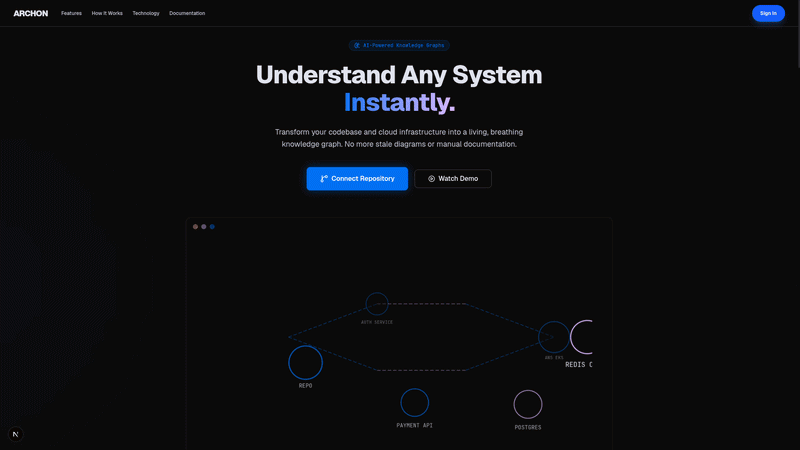

<p align="center">
  
</p>

<div align="center">

# 🏛️ Archon — AI-Powered Developer Platform

**Transform any repository into a complete AI-powered developer experience.**

[](https://nextjs.org)
[](https://www.typescriptlang.org)
[](https://www.prisma.io)
[](https://www.postgresql.org)
[](https://openai.com)
[](https://kubernetes.io)
[](https://docker.com)
[](LICENSE)

<br />

**A unified AI-powered developer platform combining architecture intelligence, Kubernetes management, Docker operations, CI/CD pipelines, security scanning, code review, and developer tools — all in one place.**

</div>

---

## ✨ Platform Features

### 🧠 AI Intelligence
| Feature | Description |
|---------|-------------|
| **AI Repository Chat** | RAG-powered chat that understands your codebase — ask about architecture, find code, generate docs |
| **Semantic Code Search** | Search by meaning instead of keywords — find authentication logic, API routes, database connections |
| **AI Code Review** | Automated review of PRs, commits, and files — detects bugs, security issues, performance problems |
| **AI Documentation** | Auto-generate README, API docs, architecture docs, deployment guides, and release notes |
| **AI Architecture Analysis** | Pattern classification, tech stack enrichment, design recommendations |
| **Knowledge Graph** | Entity-relationship graph from code analysis with interactive visualization |

### 🏗️ Infrastructure Management
| Feature | Description |
|---------|-------------|
| **Kubernetes Dashboard** | Lens-like interface — manage pods, deployments, services, ingress, secrets, configmaps, with metrics, logs, YAML editor, and AI troubleshooting |
| **Docker Dashboard** | Manage images, containers, volumes, networks — with stats, logs, terminal access, and cleanup |
| **DevOps Dashboard** | CI/CD pipeline tracking, deployment history, environment variables, secrets manager, build artifacts |

### 🔬 Analysis & Insights
| Feature | Description |
|---------|-------------|
| **Repository Analytics** | Language distribution, lines of code, commit frequency, contributor activity, code ownership, churn, technical debt |
| **Security Center** | Dependency scanning, secret detection, container image scanning, OWASP recommendations, license checking |
| **Database Dashboard** | Prisma schema viewer, table browser, relationship explorer, migration history, query runner |
| **Architecture Visualization** | Interactive system architecture, dependency graphs, API graphs, ER diagrams, call graphs |

### 🛠️ Developer Tools
| Feature | Description |
|---------|-------------|
| **Regex Tester** | Test regular expressions in real-time |
| **JSON/YAML Formatter** | Format, validate, and beautify JSON and YAML |
| **Base64 Encoder/Decoder** | Encode and decode Base64 strings |
| **JWT Decoder** | Inspect JWT tokens — decode header, payload, and signature |
| **UUID Generator** | Generate UUID v4 and v7 |
| **Hash Generator** | Generate MD5, SHA1, SHA256, SHA512 hashes |
| **Cron Parser** | Parse cron expressions with human-readable descriptions |
| **SQL Formatter** | Format and beautify SQL queries |

### 🔔 Operations
| Feature | Description |
|---------|-------------|
| **Notification Center** | Centralized notifications for GitHub events, deployments, security alerts, build failures, container crashes |
| **Global Search** | Search across repositories, files, functions, issues, PRs, commits, containers, pods, secrets, deployments |
| **Command Palette** | ⌘K quick access to all features and navigation |
| **Observability** | Structured logging, distributed tracing, metrics collection, health checks |

---

## 📊 Dashboard Overview

The main dashboard provides at-a-glance visibility into your entire development ecosystem:

- **Health Score** — Overall project and infrastructure health
- **Security Score** — Vulnerability and compliance status
- **AI Score** — AI-powered code quality and architecture rating
- **Repository Status** — Connected repos, sync status, analysis progress
- **Quick Actions** — New chat, code review, analytics, security scan

---

## 🔄 Architecture Pipeline

```
Repository Import (GitHub OAuth)
        │
        ▼
  Analysis Pipeline
  ┌─────────────────────────────────┐
  │ Clone → File Walk → AST Parse   │
  │ → Detect Tech → Build Graph     │
  │ → AI Analysis → Generate Docs   │
  └─────────────────────────────────┘
        │
        ▼
  Platform Capabilities
  ┌──────────────────────────────────────────────────┐
  │  Architecture  │  Kubernetes  │  Docker  │  DevOps │
  │  Chat & Search │  Code Review │ Security │  Tools  │
  └──────────────────────────────────────────────────┘
```

---

## 🚀 Quick Start

### Prerequisites

- **Node.js** 18+
- **PostgreSQL** 14+ (with pgvector)
- **GitHub OAuth App** — For authentication
- **Google OAuth App** — For authentication
- **OpenAI API Key** — For AI features
- **Docker** (optional) — For container management features
- **kubectl** (optional) — For Kubernetes management features

### Installation

```bash
# Clone the repository
git clone https://github.com/your-org/archon.git
cd archon

# Install dependencies
npm install

# Set up environment variables
cp .env.example .env
# Edit .env with your credentials

# Initialize the database
npm run db:generate
npm run db:migrate

# Start the development server
npm run dev
```

The application will be available at [http://localhost:3000](http://localhost:3000).

### Docker

```bash
docker compose up -d
```

### Kubernetes

```bash
kubectl apply -f k8s/namespace.yaml
kubectl create secret generic archon-secrets --from-env-file=.env
kubectl apply -f k8s/
```

---

## 🗺️ API Reference

### Intelligence
| Method | Endpoint | Description |
|--------|----------|-------------|
| POST | `/api/ai/chat` | Streaming AI chat with repository context |
| POST | `/api/semantic-search` | Semantic code search by meaning |
| POST | `/api/code-review` | Review code, PRs, or files for issues |
| POST | `/api/code-review/analyze-file` | Analyze a single file |
| POST | `/api/docs` | Generate documentation |

### Infrastructure
| Method | Endpoint | Description |
|--------|----------|-------------|
| GET | `/api/kubernetes/namespaces` | List all namespaces |
| GET | `/api/kubernetes/pods` | List pods (query: namespace) |
| GET | `/api/kubernetes/deployments` | List deployments |
| POST | `/api/kubernetes/deployments` | Scale deployment |
| GET | `/api/kubernetes/services` | List services |
| GET | `/api/kubernetes/events` | List events |
| GET | `/api/kubernetes/metrics` | Resource metrics |
| GET | `/api/docker/images` | List Docker images |
| GET | `/api/docker/containers` | List containers |
| PATCH | `/api/docker/containers/[id]` | Start/stop/restart container |
| GET | `/api/docker/containers/[id]/logs` | Container logs |
| GET | `/api/docker/containers/[id]/stats` | Container stats |
| GET | `/api/docker/volumes` | List volumes |
| GET | `/api/docker/networks` | List networks |

### Analytics & Security
| Method | Endpoint | Description |
|--------|----------|-------------|
| GET | `/api/analytics` | Repository analytics (language, LOC, commits, contributors) |
| GET | `/api/security` | Security overview and scan results |
| POST | `/api/security/secrets` | Scan content for secrets |
| GET | `/api/database` | Database overview and health |
| GET | `/api/database/tables` | List database tables |
| POST | `/api/database/query` | Run safe SELECT queries |

### Operations
| Method | Endpoint | Description |
|--------|----------|-------------|
| GET | `/api/notifications` | User notifications |
| POST | `/api/notifications` | Mark notifications as read |
| GET | `/api/devops` | CI/CD and deployment overview |
| POST | `/api/devtools` | Developer tools (regex, JSON, JWT, etc.) |
| GET | `/api/dashboard/stats` | Enhanced dashboard statistics |

### Core
| Method | Endpoint | Description |
|--------|----------|-------------|
| GET | `/api/auth/me` | Current user profile |
| GET/POST | `/api/workspace` | Workspace management |
| GET/POST | `/api/projects` | Project CRUD |
| GET | `/api/repositories` | Imported repositories |
| POST | `/api/github/sync` | Trigger repository sync |
| GET | `/api/search` | Global search |
| GET | `/api/health` | System diagnostics |

---

## 🧩 Architecture

### Module Structure

```
archon/
├── app/                           # Next.js App Router
│   ├── dashboard/                 # 20+ protected dashboard pages
│   │   ├── analytics/             # Repository analytics
│   │   ├── chat/                  # AI repository chat
│   │   ├── code-review/           # PR and file code review
│   │   ├── kubernetes/            # Lens-like K8s dashboard
│   │   ├── docker/                # Docker management
│   │   ├── devops/                # CI/CD pipeline management
│   │   ├── security/              # Security center
│   │   ├── documentation/         # AI documentation generator
│   │   ├── database/              # Prisma database dashboard
│   │   ├── developer-tools/       # Regex, JSON, JWT, etc.
│   │   ├── notifications/         # Notification center
│   │   ├── search/                # Global search
│   │   ├── architecture/          # Interactive React Flow diagrams
│   │   ├── knowledge-graph/       # Entity-relationship graph
│   │   ├── ai-assistant/          # Streaming AI chat
│   │   ├── timeline/              # Architecture timeline
│   │   ├── repositories/          # GitHub import + analysis
│   │   ├── projects/              # Project management
│   │   ├── team/                  # Team management
│   │   ├── billing/               # Subscription management
│   │   ├── settings/              # User settings
│   │   └── impact/                # Blast radius analysis
│   └── api/                       # 40+ REST API endpoints
├── components/
│   ├── layout/                    # Dashboard sidebar + header + search
│   ├── landing/                   # Landing page sections
│   ├── ui/                        # 30+ shadcn/ui components
│   └── providers/                 # Session provider
├── lib/
│   ├── kubernetes/                # Kubernetes client (kubectl wrapper)
│   ├── docker/                    # Docker client (Docker CLI wrapper)
│   ├── notifications/             # Notification center service
│   ├── observability/             # Logger, tracer, metrics, health
│   ├── codereview/                # Pattern-based code review engine
│   ├── semantic-search/           # Semantic code search engine
│   ├── analytics/                 # Repository analytics engine
│   ├── security/                  # Security scanning engine
│   ├── documentation/             # AI documentation generator
│   ├── devtools/                  # Developer tools (regex, JWT, cron, etc.)
│   ├── auth/                      # Auth.js configuration
│   ├── analysis/                  # Core analysis engine
│   │   ├── detectors/             # 7 technology detectors
│   │   ├── ast-parser.ts          # Multi-language AST parser
│   │   ├── graph-builder.ts       # Knowledge graph construction
│   │   ├── diagram-generator.ts   # React Flow layout generator
│   │   ├── doc-generator.ts       # Markdown documentation
│   │   ├── security.ts            # Secret scanning engine
│   │   └── clone.ts               # Git clone with timeout
│   ├── ai/                        # OpenAI integration
│   ├── db/                        # Prisma client singleton
│   ├── stripe/                    # Stripe billing integration
│   ├── storage/                   # File storage abstraction
│   ├── health/                    # Health check diagnostics
│   ├── github/                    # GitHub API integration
│   ├── utils/                     # Utility functions
│   └── env.ts                     # Zod-validated environment
├── prisma/
│   ├── schema.prisma              # 19 database models
│   └── migrations/
├── types/                         # Global TypeScript types
├── k8s/                           # Kubernetes deployment manifests
├── scripts/                       # Entrypoint and env validation
├── Dockerfile                     # Multi-stage Docker build
└── docker-compose.yml             # Local development stack
```

---

## 🔐 Environment Variables

| Variable | Required | Description |
|----------|:--------:|-------------|
| `DATABASE_URL` | ✅ | PostgreSQL connection URL (supports pgBouncer) |
| `AUTH_SECRET` | ✅ | Auth.js secret (min 32 chars) |
| `AUTH_GITHUB_ID` | ✅ | GitHub OAuth Client ID |
| `AUTH_GITHUB_SECRET` | ✅ | GitHub OAuth Client Secret |
| `AUTH_GOOGLE_ID` | ❌ | Google OAuth Client ID |
| `AUTH_GOOGLE_SECRET` | ❌ | Google OAuth Client Secret |
| `OPENAI_API_KEY` | ❌ | OpenAI API key (needed for AI features) |
| `OPENAI_MODEL` | ❌ | Model identifier (default: `gpt-4o-mini`) |
| `NEXT_PUBLIC_APP_URL` | ✅ | Public application URL |
| `STRIPE_SECRET_KEY` | ❌ | Stripe secret key for billing |
| `SENTRY_DSN` | ❌ | Sentry DSN for error tracking |
| `NEXT_PUBLIC_POSTHOG_KEY` | ❌ | PostHog analytics key |

---

## 🤝 Contributing

```bash
npm run dev       # Development server
npm run build     # Production build
npm run lint      # ESLint
npm run typecheck # TypeScript check
npm run db:studio # Prisma Studio
```

### Guidelines

- TypeScript strict mode everywhere
- shadcn/ui components for all UI
- Dark mode by default
- Server Components where possible
- Zod validation for API inputs
- One Prisma model per domain concept

---

## 📄 License

MIT License — see [LICENSE](LICENSE) for details.

---

<p align="center">
  Built with ❤️ for Developers, DevOps Engineers, Platform Teams, and Software Architects.
</p>
